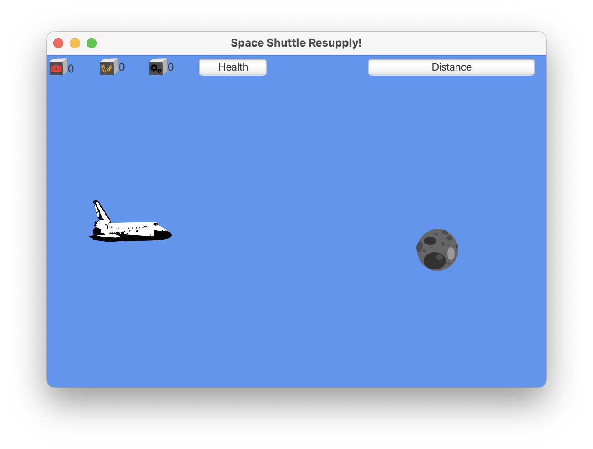

# L10-ListAdventures

## Welcome to List Adventures! A Space Shuttle Mini-Game

Open shuttleResupply-view.fxml in SceneBuilder to see the basics of our game! It's not very complete yet, but it has 'almost' all the building blocks we need.

## Primary Goals (ArrayLists!)

PART I: (Steps 1-7) - GameLoop.java

Games thrive on lots of moving parts! The best way for us to keep track of all those moving parts, is with a data structure.

For this game, we'll be using Java's `List` Interface for _iterating_ through a collection of GameObjects. While there are many implementations of the `List` Interface, in this case, we'll use the `ArrayList` which is a more powerful version of the classic [] array. (dyanimc resizing!)

PART II: (Steps 8-11) - SpaceShuttle.java

Now that we have some cargo floating through space for pickup, we need to transfer any retrieved cargo into the Space Shuttle's inventory. For this part, follow the steps in `SpaceShuttle`, adding three new `ArrayLists`, one for medical supplies, one for food, and one for parts.

Once the ArrayLists have been filled with cargo, you'll need to iterate through the lists, adding the cargo contents to a cargo manifest string.

## Stretch Goals (Expand the Fun!)

A) Add a new resource type to the game -- create a new image, string, and enumeration value.

B) Add a SpaceStation class that extends GameObject -- the space shuttle should reach the space station at the end of the distance.
- Extra stretch goal: make the space station start small, and slowly grow while moving towards the space shuttle.

C) Add a 'boost' resource that temporarily increases the maneuvering speed of the Space Shuttle.

D) Change the spawn logic so that Asteroids are more likely to spawn that resources.

E) Add a missile class that can be spawned by the space shuttle to destroy asteroids!

F) Write a _Calaveras Literarias_ to display if the space shuttle is destroyed before reaching the end.
- Calaveras Literarias are short, witty rhyming poems written around **Dia de los Muertos**. They typically are a humorous and playful epitaph of someone's demise. Use an AABB rhyme scheme.